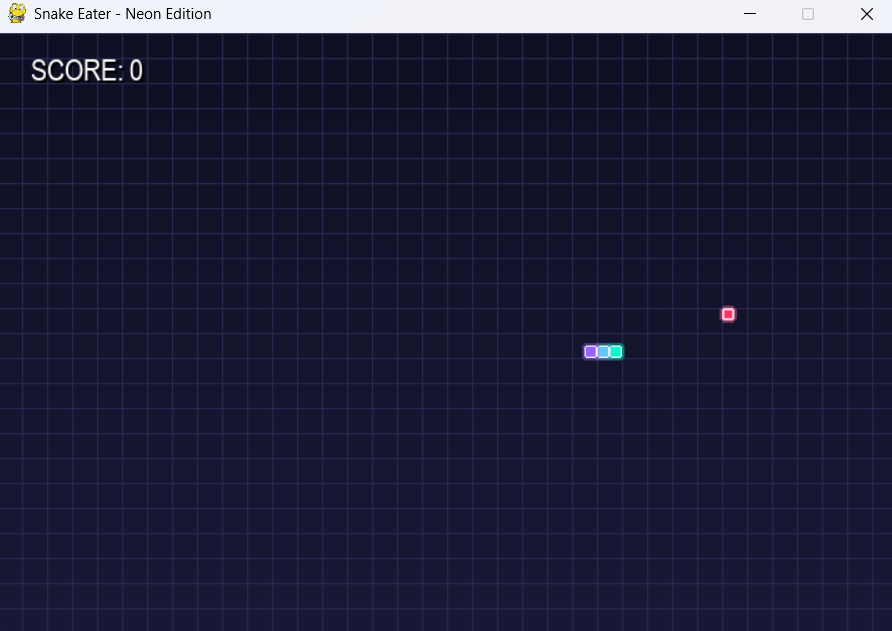
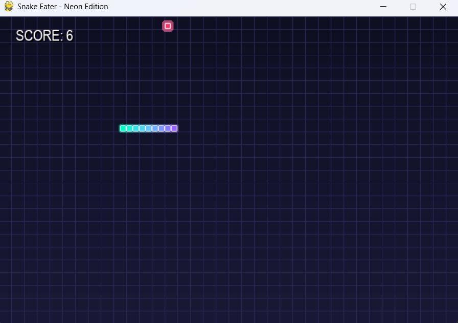
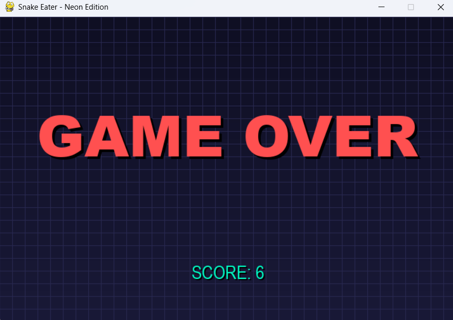

```
   _____ _   _          _  ________ ______      _______ ______ _____  
  / ____| \ | |   /\   | |/ /  ____|  ____|    |__   __|  ____|  __ \ 
 | (___ |  \| |  /  \  | ' /| |__  | |__    ______| |  | |__  | |__) |
  \___ \| . ` | / /\ \ |  < |  __| |  __|  |______| |  |  __| |  _  / 
  ____) | |\  |/ ____ \| . \| |____| |____        | |  | |____| | \ \ 
 |_____/|_| \_/_/    \_\_|\_\______|______|       |_|  |______|_|  \_\
                                                                        
                    🐍 Modern Neon Edition 🎮
```

<div align="center">

**A visually enhanced snake game with modern neon/cyberpunk aesthetics**

*Featuring gradient effects • Smooth animations • Dynamic visual feedback*

[](https://www.python.org)
[](https://www.pygame.org)
[](LICENSE)

</div>

---

## Motivation

This project was developed as part of the **Introduction to Problem Solving & Programming** course to demonstrate the practical application of fundamental programming concepts in a real-world scenario. The primary objectives include:

- **Applying Core Programming Concepts**: Implementing loops, conditionals, functions, and data structures
- **Understanding Game Development**: Learning event-driven programming and real-time game mechanics
- **Problem-Solving Skills**: Designing algorithms for collision detection, movement, and scoring systems
- **Code Organization**: Practicing modular programming and code documentation
- **Visual Design**: Exploring graphics programming and user interface design

The project bridges theoretical knowledge with practical implementation, creating an engaging and interactive application that demonstrates proficiency in Python programming.

## Project Description

Snake Eater is a classic arcade-style game where the player controls a snake that grows longer as it consumes food. The game features:

- **Modern Visual Design**: Neon cyberpunk theme with gradient backgrounds and glowing effects
- **Smooth Animations**: Pulsing food effects and gradient snake coloring from head to tail
- **Multiple Difficulty Levels**: Adjustable game speed (Easy, Medium, Hard, Harder, Impossible)
- **Intuitive Controls**: Support for both arrow keys and WASD movement
- **Score Tracking**: Real-time score display with styled text and shadows
- **Collision Detection**: Accurate boundary and self-collision detection

### Technical Highlights

- **Gradient Rendering**: Dynamic background gradients and snake color transitions
- **Animation System**: Mathematical functions (sine waves) for pulsing food effects
- **Modular Design**: Separate functions for rendering, game logic, and UI elements
- **Event-Driven Architecture**: Responsive keyboard input handling

## Objectives and Expected Outcomes

### Learning Objectives

1. **Data Structures**: Utilize lists to manage snake body segments and coordinates
2. **Algorithm Design**: Implement movement, collision detection, and growth mechanics
3. **Function Decomposition**: Break down complex problems into manageable functions
4. **Graphics Programming**: Work with Pygame library for rendering and animations
5. **User Input Handling**: Process keyboard events for game control

### Expected Outcomes

- A fully functional, playable snake game
- Clean, well-documented code following best practices
- Understanding of game loop architecture
- Experience with Python libraries and modules
- Ability to extend and modify game features

## Development Process

The project followed a structured development approach:

1. **Problem Definition**: Identify core game mechanics and user requirements
2. **Requirement Analysis**: Define features, controls, and visual design
3. **Top-Down Design**: Break down the game into modular components
   - Game initialization
   - Input handling
   - Movement logic
   - Collision detection
   - Rendering system
   - Score management
4. **Algorithm Development**: Design algorithms for:
   - Snake movement and growth
   - Food spawning
   - Collision detection (boundaries and self-collision)
   - Gradient color calculations
5. **Implementation**: Code each module with proper documentation
6. **Testing and Refinement**: Debug, optimize, and enhance visual effects

## Prerequisites

Before running the game, ensure you have the following installed:

- **Python 3.x**: Download from [python.org](https://www.python.org)
- **Pygame Library**: Install using pip (see installation instructions below)

## Installation

### Step 1: Install Python

If Python is not already installed, download and install Python 3 from the [official website](https://www.python.org/downloads/).

### Step 2: Install Pygame

Open your terminal or command prompt and run:

```bash
pip install pygame
```

Or for Python 3 specifically:

```bash
pip3 install pygame
```

### Step 3: Download the Project

Clone or download this repository to your local machine.

## How to Run

Navigate to the project directory and run:

```bash
python "Snake Game.py"
```

Or:

```bash
python3 "Snake Game.py"
```

The game window will open automatically.

## Game Controls

- **Arrow Keys** or **WASD**: Control snake direction
  - ↑ / W: Move Up
  - ↓ / S: Move Down
  - ← / A: Move Left
  - → / D: Move Right
- **ESC**: Quit the game

## Difficulty Settings

The game speed can be adjusted by modifying the `difficulty` variable in the code (line 15):

```python
difficulty = 25  # Default: Medium
```

Available difficulty levels:
- **Easy**: 10
- **Medium**: 25 (default)
- **Hard**: 40
- **Harder**: 60
- **Impossible**: 120

Higher values = faster snake = more challenging gameplay.

## Project Structure

```
snake-pygame-master/
├── Snake Game.py          # Main game file
├── README.md              # This file
├── LICENSE                # MIT License
├── .gitignore            # Git ignore file
├── SCREENSHOT_GUIDE.md   # Screenshot capture guide
├── GITHUB_GUIDE.md       # GitHub submission guide
└── screenshots/          # Game screenshots
    ├── startup.png
    ├── gameplay.png
    └── gameover.png
```

## Screenshots

### Game Startup


### Active Gameplay


### Game Over Screen


## Concepts Applied

This project demonstrates the following programming concepts learned in the course:

### Data Structures
- **Lists**: Snake body segments stored as list of coordinate pairs
- **Tuples**: Color values represented as RGB tuples
- **Dictionaries**: Implicit use in Pygame's color system

### Control Structures
- **Loops**: Main game loop, rendering loops for gradients and grid
- **Conditionals**: Direction validation, collision detection, game state management

### Functions
- `draw_gradient_background()`: Renders gradient background
- `draw_grid()`: Draws grid overlay
- `get_snake_color()`: Calculates gradient colors for snake segments
- `game_over()`: Handles game over state
- `show_score()`: Displays score with styling

### Algorithms
- **Collision Detection**: Boundary checking and self-collision detection
- **Movement Algorithm**: Direction-based position updates
- **Growth Mechanism**: Dynamic list manipulation for snake body
- **Color Interpolation**: Mathematical gradient calculations

### Object-Oriented Concepts
- **Pygame Objects**: Surface, Rect, Color, Clock
- **Event Handling**: Event-driven programming model

## Code Customization

The code is well-commented and modular, making it easy to customize:

- **Colors**: Modify color variables (lines 37-57) for different themes
- **Window Size**: Adjust `frame_size_x` and `frame_size_y` (lines 18-19)
- **Visual Effects**: Modify gradient, glow, and animation parameters
- **Game Mechanics**: Adjust snake speed, starting length, or food spawn logic

## License

This project is licensed under the MIT License - see the [LICENSE](LICENSE) file for details.

## Contact Information

**Developer**: Amatul Hasan Zaidi  
**Email**: amatul.25mib10024@vitbhopal.ac.in  
**Institution**: VIT Bhopal  
**Course**: Introduction to Problem Solving & Programming  

For questions, suggestions, or issues, please feel free to reach out via email.

## Notes

### Educational Purpose
This project was created as part of academic coursework to demonstrate programming proficiency and problem-solving skills. The code is original work developed by applying concepts learned in class.

### Future Enhancements
Potential improvements for future versions:
- High score persistence using file I/O
- Multiple game modes (e.g., obstacles, power-ups)
- Sound effects and background music
- Multiplayer support
- Mobile touch controls

### Acknowledgments
- **Pygame Community**: For excellent documentation and tutorials
- **Course Instructors**: For teaching fundamental programming concepts
- **Python Software Foundation**: For the Python programming language

### Technical Notes
- The game uses a grid-based coordinate system (10x10 pixel cells)
- Frame rate is controlled by the difficulty setting
- All visual effects are rendered in real-time
- No external assets required (all graphics generated programmatically)

---

**Submission Date**: November 2025  
**Project Deadline**: November 25th, 2025
